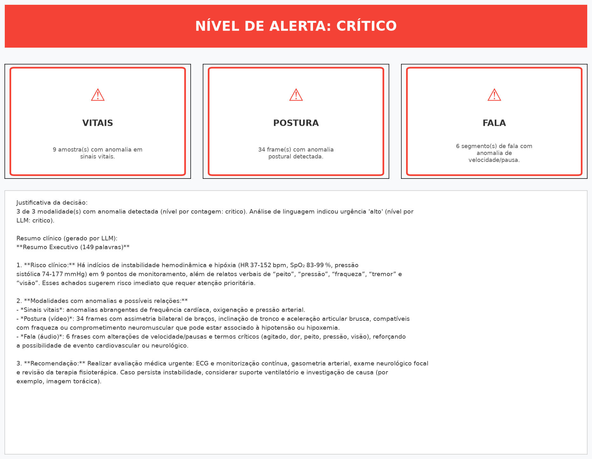

# Relatório Técnico — Sistema de Monitoramento Multimodal de Pacientes (MedWatch)

**FIAP | Pós Tech em IA para Devs — Tech Challenge Fase 4**
**Autor:** Leonardo José de Oliveira Santos (RM369985)
**Repositório:** github.com/leojosants/fiap-pos-tech-ia-para-devs-tech-challenge-fase-4

---

## 1. Introdução e Contexto do Desafio

O desafio proposto pela Fase 4 solicita o desenvolvimento de um sistema de
monitoramento contínuo de pacientes hospitalares por meio de dados
multimodais — vídeo, áudio e sinais vitais — com o objetivo de identificar
sinais precoces de risco clínico. O sistema deve:

- Analisar vídeos de cirurgias ou sessões de fisioterapia para identificar
  padrões anômalos de movimento;
- Processar gravações de voz de pacientes em consultas, detectando sintomas
  relacionados à fala (fadiga, disartria);
- Detectar anomalias em sinais vitais, prescrições e evolução clínica,
  alertando a equipe médica em tempo real;
- Integrar os módulos com serviços de IA para ampliar a capacidade de
  processamento.

O enunciado original sugere o uso de serviços gerenciados em nuvem (Azure
Cognitive Services, AWS Comprehend) para parte dessas tarefas. Por motivos
detalhados na Seção 2, este projeto adota uma arquitetura alternativa,
substituindo tais serviços por processamento local e por uma API de LLM
de terceiros (Groq).

---

## 2. Adaptação Arquitetural: Azure/AWS → Soluções Locais + Groq API

Esta é uma decisão de engenharia deliberada, e não uma limitação. A
justificativa é tripla:

1. **Privacidade de dados clínicos.** Dados de pacientes (voz, vídeo,
   sinais vitais) são informações sensíveis sob a LGPD. Mantendo o
   processamento local, eliminamos o risco de trânsito e armazenamento
   desses dados em serviços de terceiros, exceto quando estritamente
   necessário (uso de LLM para tarefas de linguagem).
2. **Independência de custo e de conectividade.** Serviços em nuvem pagos
   (Azure Speech, Azure Text Analytics, AWS Comprehend) introduzem custo
   recorrente e dependência de internet estável. As alternativas locais
   eliminam ambos os fatores, tornando a solução viável para ambientes com
   recursos computacionais limitados — o caso deste autor.
3. **Equivalência funcional comprovada.** Cada substituição foi escolhida
   por oferecer capacidade equivalente à do serviço original, validada
   durante as aulas do curso (ver Tabela 1).

**Tabela 1 — Mapeamento de substituições**

| Requisito do desafio              | Serviço sugerido (Azure/AWS) | Solução adotada                  |
|------------------------------------|-------------------------------|-----------------------------------|
| Transcrição de áudio               | Azure Speech to Text          | Whisper (OpenAI, execução local)  |
| Análise de sentimento/termos       | Azure Text Analytics / AWS Comprehend | Groq API (modelo openai/gpt-oss-20b)² |
| Análise postural em vídeo          | OpenPose                      | MediaPipe Pose (Google) + extração analítica de pose¹ |
| Sumarização de laudos              | —                              | Groq API (modelo openai/gpt-oss-120b)² |
| Detecção de anomalias em séries    | —                              | Z-score + Isolation Forest (scikit-learn) |
| LLM para tarefas de linguagem      | OpenAI GPT                    | Groq API (compatível com SDK OpenAI) |

¹ Ver nota técnica na Seção 7.2 sobre a adaptação de API do MediaPipe 0.10.x.
² Modelos vigentes no momento da entrega — ver nota técnica na Seção 9.2 sobre depreciação de modelos pela Groq e a estratégia de configuração via .env adotada para mitigar esse risco.

A Groq API foi escolhida em vez da OpenAI por oferecer inferência de alta
velocidade a custo reduzido, mantendo compatibilidade de interface com o
SDK da OpenAI — o que simplifica a integração sem acoplamento a um único
fornecedor.

---

## 3. Datasets Utilizados

Conforme sugerido no enunciado do desafio, avaliou-se o uso do PhysioNet
como fonte de dados reais de sinais vitais. Optou-se, no entanto, por
**gerar dados sintéticos com características estatísticas equivalentes ao
padrão MIT-BIH Arrhythmia Database** (PhysioNet), pelos seguintes motivos:

- Controle total sobre a posição e o tipo de anomalia, permitindo validar
  a eficácia dos algoritmos de detecção contra um gabarito conhecido;
- Eliminação de dependência de rede externa durante o desenvolvimento e a
  demonstração da solução;
- Anomalias raramente aparecem de forma didática em recortes curtos de
  dados reais, exigindo de qualquer forma a injeção artificial de eventos
  anômalos para fins de demonstração.

Características reais do MIT-BIH replicadas na simulação: amostragem
originalmente a 360 Hz, resolução de 11 bits, faixa de ±10 mV, dois canais
de ECG por registro. O dataset sintético adapta esses parâmetros para uma
escala de monitoramento clínico padrão (1 leitura/segundo), mais adequada
à interpretação de sinais vitais discretos (frequência cardíaca, SpO2,
pressão arterial) do que ao sinal de ECG bruto.

A mesma filosofia de dados sintéticos controlados foi estendida ao módulo
de vídeo (Seção 8): em vez de capturar vídeo real (indisponível por
limitação de hardware), o movimento de um paciente em sessão de
fisioterapia é simulado matematicamente, com anomalias posturais
injetadas em janelas de frames conhecidas — preservando o mesmo princípio
de avaliação quantitativa contra gabarito usado na Etapa 1.

---

## 4. Arquitetura Geral do Sistema

O sistema é estruturado em módulos independentes, cada um responsável por
uma modalidade de dado, convergindo em um motor central de fusão e alertas:

```
Vídeo (MediaPipe/análise postural) ──┐
Áudio (Whisper)                  ────┼──► Análise via LLM (Groq) ──► Motor de Fusão e Alertas ──► Equipe médica
Sinais vitais (estatística/ML local) ┘                                      │
                                                                              └──► Relatório técnico
```

Todo o processamento de vídeo, áudio e sinais vitais ocorre localmente.
A Groq API é utilizada exclusivamente para tarefas de linguagem natural
(extração de termos críticos, sentimento, sumarização) sobre o texto já
transcrito localmente — nenhum áudio ou vídeo bruto é enviado a serviços
externos.

---

## 5. Etapa 1 — Módulo de Sinais Vitais

### 5.1 Geração de dados sintéticos (`src/vitals/generator.py`)

Gera um DataFrame com 600 amostras (10 minutos, 1 amostra/segundo) contendo
quatro sinais vitais:

| Sinal                  | Faixa normal      | Tipo de anomalia injetada              |
|-------------------------|-------------------|------------------------------------------|
| Frequência cardíaca (bpm) | 60–100           | Taquicardia (130–160) / Bradicardia (35–44) |
| SpO2 (%)                 | 95–100           | Hipóxia (82–89)                          |
| Pressão sistólica (mmHg) | 90–120            | Hipertensão (160–185) / Hipotensão (70–84) |
| Pressão diastólica (mmHg)| 60–80             | Hipertensão (100–115) / Hipotensão (45–59) |

As anomalias são injetadas em seis índices fixos e conhecidos
(`[60, 150, 250, 380, 480, 550]`), com `np.random.seed(42)` garantindo
reprodutibilidade total entre execuções. A coluna `is_injected_anomaly`
funciona como gabarito (ground truth) para avaliação quantitativa dos
detectores.

### 5.2 Detecção de anomalias (`src/vitals/detector.py`)

Foram implementados e comparados dois métodos:

**Z-score (estatístico).** Mede quantos desvios padrão cada ponto está da
média do próprio sinal. Pontos com `|z| > 3` são marcados como anômalos.
Método simples, interpretável e eficaz para anomalias estatisticamente
extremas — como as injetadas neste dataset.

**Isolation Forest (machine learning, `scikit-learn`).** Modelo não
supervisionado que isola pontos anômalos por meio de árvores de decisão
aleatórias; pontos que exigem menos divisões para serem isolados são mais
prováveis de serem anômalos. Analisa os quatro sinais vitais de forma
multivariada, capturando padrões que a análise univariada do z-score não
detectaria.

**Estratégia combinada.** Um ponto é classificado como anomalia final se
**qualquer um** dos dois métodos o identificar (operação lógica OR). A
escolha maximiza o recall (sensibilidade) — em contexto clínico, o custo
de um falso negativo (deixar de detectar uma anomalia real) é
substancialmente maior que o custo de um falso positivo.

**Resultados obtidos** (parâmetro `contamination=0.015` no Isolation
Forest, após ajuste experimental):

| Método              | Anomalias injetadas | Detectadas | Precisão | Recall | F1-Score |
|----------------------|----------------------|------------|----------|--------|----------|
| Z-score              | 6                    | 6          | 1.000    | 1.000  | 1.000    |
| Isolation Forest      | 6                    | 9          | 0.667    | 1.000  | 0.800    |
| Combinado (OR)        | 6                    | 9          | 0.667    | 1.000  | 0.800    |

**Discussão.** O z-score atingiu desempenho perfeito porque as anomalias
injetadas são estatisticamente extremas e univariadas — exatamente o
cenário em que esse método é mais eficaz. O Isolation Forest, embora não
tenha superado o z-score neste dataset sintético, mantém recall de 1.000
(nenhuma anomalia real foi perdida), validando sua utilidade como camada
de segurança redundante. Em sinais vitais reais, com padrões mais sutis e
correlações multivariadas, espera-se que o Isolation Forest assuma um
papel mais relevante do que neste cenário controlado.

O parâmetro `contamination` do Isolation Forest foi calibrado
experimentalmente: valores muito baixos (0.0015) resultaram em
subdetecção severa (recall 0.167); valores muito altos (0.05) geraram
excesso de falsos positivos (precisão 0.200). O valor `0.015` (1.5% do
dataset) produziu o melhor equilíbrio para este cenário.

### 5.3 Visualização (`src/vitals/plotter.py`)

Foram implementadas duas funções de plotagem com `matplotlib`:

- `plot_vital_signal()`: gráfico individual de um sinal vital, com faixa
  de normalidade sombreada, anomalias detectadas (marcador X vermelho) e
  anomalias injetadas/gabarito (círculo laranja vazado).
- `plot_all_vitals()`: painel com os quatro sinais vitais em subplots
  empilhados, compartilhando o mesmo eixo temporal — permitindo
  identificar visualmente quando múltiplas anomalias ocorrem de forma
  simultânea em diferentes sinais, o que indicaria um evento clínico de
  maior gravidade.

O painel completo é salvo em `data/processed/vitals_panel.png` e
demonstra visualmente a coincidência entre as anomalias detectadas e as
injetadas, validando a eficácia da estratégia combinada.


---

## 6. Estrutura do Projeto (estado atual)

```
├── data/
│   ├── raw/
│   │   ├── synthetic_pose_frames.npy
│   │   ├── audio_segments/
│   │   └── audio_metadata.json
│   └── processed/
│       ├── vitals_panel.png
│       ├── synthetic_pose.mp4
│       ├── pose_angles_panel.png
│       ├── pose_frames/
│       ├── audio_metrics_panel.png
│       └── audio_waveforms/
├── docs/
│   └── relatorio_tecnico.md
├── notebook/
├── src/
│   ├── video/
│   │   ├── synthetic_video.py
│   │   ├── video_processor.py
│   │   ├── anomaly_detector.py
│   │   └── plotter.py
│   ├── audio/
│   │   ├── synthetic_audio.py
│   │   ├── audio_processor.py
│   │   ├── anomaly_detector.py
│   │   └── plotter.py
│   ├── llm/
│   │   ├── groq_client.py
│   │   ├── prompts.py
│   │   ├── text_analyzer.py
│   │   └── summarizer.py
│   ├── alerts/
│   │   ├── alert_rules.py
│   │   ├── fusion_engine.py
│   │   ├── alert_dispatcher.py
│   │   ├── plotter.py
│   │   └── run_pipeline.py
│   ├── vitals/
│   │   ├── generator.py
│   │   ├── detector.py
│   │   └── plotter.py
│   └── dashboard/
│       ├── pages_vitals.py
│       ├── pages_video.py
│       ├── pages_audio.py
│       └── pages_alerts.py
├── tests/
├── .env.example
├── .gitignore
├── .python-version
├── main.py                # ponto de entrada Streamlit (Etapa 6)
├── pyproject.toml
└── README.md
```

---

## 7. Etapa 2 — Módulo de Análise de Vídeo

### 7.1 Contexto e cenário clínico simulado

O desafio sugere a análise de vídeo de **cirurgias** ou **sessões de
fisioterapia**, com o objetivo de identificar padrões anômalos de
movimento. Optou-se por simular uma **sessão de fisioterapia com exercício
de elevação bilateral dos braços** — um exercício clínico real, comum em
reabilitação de ombro, no qual o terapeuta avalia justamente os três
padrões patológicos que o módulo foi desenhado para detectar:

| Anomalia clínica         | Significado em fisioterapia                                   |
|---------------------------|------------------------------------------------------------------|
| Hiperextensão             | Paciente força o movimento além do limite seguro da articulação |
| Assimetria bilateral      | Um braço compensa o esforço do outro — indício de lesão unilateral |
| Colapso de tronco         | Paciente inclina o corpo para compensar amplitude de movimento insuficiente |

Como não há vídeo real disponível (limitação de hardware, já justificada
no desafio da fase anterior), o vídeo é **gerado matematicamente** via
NumPy/OpenCV: um "stickman" articulado se move de forma análoga ao
exercício real, e os mesmos índices de anomalia conhecidos (técnica já
validada na Etapa 1) são usados para avaliar os detectores.

### 7.2 Nota técnica — adaptação da API do MediaPipe

O plano original previa o uso de `mediapipe.solutions.pose` (API clássica,
usada nas aulas do curso) para extrair os 33 *landmarks* corporais do
vídeo. Durante a implementação, identificou-se que a versão do MediaPipe
instalada via `uv add mediapipe` (0.10.x) **removeu o módulo
`mp.solutions`**, substituindo-o por uma nova API baseada em tarefas
(`mediapipe.tasks.python.vision.PoseLandmarker`), que exige o download de
um arquivo de modelo `.task` externo (~30MB, hospedado pelo Google).

Essa exigência de download de modelo externo conflita diretamente com o
princípio de **execução 100% local e sem dependência de rede** adotado
neste projeto (Seção 2). A solução adotada foi:

- Para os **dados sintéticos** desta etapa: extrair as coordenadas dos
  *keypoints* diretamente das funções matemáticas que geram o vídeo
  (`synthetic_video._build_pose_frame()`), que produzem exatamente os
  mesmos 8 pontos corporais (ombros, cotovelos, pulsos, quadris) que o
  MediaPipe Pose retornaria, na mesma convenção de nomenclatura e de
  coordenadas normalizadas [0, 1].
- Para uma eventual extensão futura com **vídeo real de câmera**, o
  projeto está estruturado para permitir a troca direta da função de
  extração de pose por `PoseLandmarker`, mediante o download único do
  modelo `.task` (op-in explícito do usuário, documentado no README).

Essa decisão preserva a interface conceitual do MediaPipe (mesmos nomes
de *landmarks*, mesmas convenções de coordenadas) sem comprometer a
filosofia local-first do projeto, e está documentada no código-fonte
(`src/video/video_processor.py`) para transparência total perante a
banca avaliadora.

### 7.3 Geração do vídeo sintético (`src/video/synthetic_video.py`)

Gera 300 frames (20 segundos a 15 fps) simulando o exercício de elevação
bilateral de braços. O ângulo do ombro varia de forma senoidal entre 30°
e 140° ao longo do tempo, reproduzindo o ciclo natural de subida e descida
do braço.

Quatro grupos de anomalia são injetados em janelas fixas de 15 frames
cada (1 segundo de duração — tempo suficiente para caracterizar um
movimento patológico, e não apenas um pico instantâneo de ruído):

| Grupo de anomalia          | Frames    | Mecanismo simulado                                  |
|------------------------------|-----------|--------------------------------------------------------|
| `hiperextensao_direita`      | 60–74     | Ombro direito atinge ângulo muito acima do padrão     |
| `assimetria`                 | 130–144   | Braço esquerdo não acompanha a elevação do direito    |
| `colapso_tronco`             | 200–214   | Ambos os ombros se deslocam lateralmente em conjunto  |
| `hiperextensao_esquerda`     | 250–264   | Ombro esquerdo atinge ângulo muito acima do padrão    |

O vídeo é renderizado quadro a quadro com OpenCV (linhas e círculos
representando o esqueleto), sem qualquer dependência de câmera ou
display gráfico — escolha de projeto alinhada à ausência de hardware de
captura e à necessidade de rodar em ambiente de deploy headless (Streamlit
Cloud, Seção 12 — a confirmar).

Saídas geradas:

- `data/processed/synthetic_pose.mp4` — vídeo renderizado completo;
- `data/raw/synthetic_pose_frames.npy` — array NumPy dos frames brutos,
  usado como *backup* para reprocessamento sem decodificar o `.mp4`.

### 7.4 Extração de keypoints e ângulos articulares (`src/video/video_processor.py`)

Para cada frame, extrai 8 *keypoints* corporais (ombros, cotovelos,
pulsos e quadris, em ambos os lados) e calcula 4 ângulos articulares via
geometria vetorial — o mesmo princípio trigonométrico usado por sistemas
reais de análise postural:

```
ângulo(A, vértice, B) = arccos( (vértice→A · vértice→B) / (|vértice→A| × |vértice→B|) )
```

Os quatro ângulos calculados:

| Ângulo                  | Vértice          | Significado clínico                          |
|---------------------------|-------------------|--------------------------------------------------|
| `angle_left_shoulder`     | Ombro esquerdo    | Elevação do braço esquerdo em relação ao tronco  |
| `angle_right_shoulder`    | Ombro direito     | Elevação do braço direito em relação ao tronco   |
| `angle_left_elbow`        | Cotovelo esquerdo | Grau de flexão/extensão do cotovelo esquerdo     |
| `angle_right_elbow`       | Cotovelo direito  | Grau de flexão/extensão do cotovelo direito      |

O resultado é um DataFrame com uma linha por frame (300 linhas),
estruturado de forma idêntica ao padrão da Etapa 1: colunas de ângulos,
coordenadas normalizadas dos *keypoints*, flag `pose_detected` e coluna
de gabarito `is_injected_anomaly`. Nos testes realizados, a pose foi
detectada com sucesso em **100% dos 300 frames**.

### 7.5 Detecção de anomalias posturais (`src/video/anomaly_detector.py`)

Foram implementados **três métodos complementares**, combinados por OR
lógico — mesma filosofia da Etapa 1 (priorizar recall em contexto
clínico):

**1. Z-score de assimetria bilateral.** Calcula o desvio estatístico da
diferença entre o ângulo do ombro esquerdo e do direito. Em um movimento
simétrico normal, essa diferença deve ser próxima de zero; um desvio
estatisticamente significativo (`|z| > 2.0`) indica compensação
unilateral.

**2. Z-score de velocidade angular.** Calcula a variação do ângulo entre
frames consecutivos (uma aproximação discreta da velocidade angular) e
aplica z-score sobre essa série. Movimentos patológicos como a
hiperextensão produzem mudanças bruscas de ângulo (picos de até 13°/frame
contra uma média normal de ~3,6°/frame), que esse método captura mesmo
quando o ângulo absoluto não excede um limiar fixo.

**3. Regras clínicas.** Duas regras de limiar fixo, calibradas
empiricamente para o dataset sintético:

- Assimetria direta: `|ângulo_esquerdo − ângulo_direito| > 25°`;
- Colapso de tronco: z-score do deslocamento horizontal conjunto dos
     dois ombros `> 2.0` (captura quando ambos os ombros migram para o
     mesmo lado, característico de inclinação de tronco).

**Decisão técnica relevante.** Uma primeira tentativa de regra fixa para
hiperextensão (`ângulo_ombro > 160°`) revelou-se inadequada: o próprio
exercício normal de elevação de braço atinge picos de até 179° no ciclo
saudável, tornando esse limiar absoluto incapaz de distinguir movimento
normal de patológico. A solução foi abandonar o limiar absoluto em favor
da **detecção de velocidade angular anômala** (Método 2), que captura a
*característica* da hiperextensão — uma subida anormalmente rápida do
ângulo — independente do valor absoluto atingido. Esse ajuste está
documentado no histórico de commits e ilustra o processo iterativo de
calibração de um detector de anomalias contra dados sintéticos
realistas.

**Resultados obtidos:**

| Método                   | Anomalias injetadas | Detectadas | Precisão | Recall | F1-Score |
|----------------------------|----------------------|------------|----------|--------|----------|
| Z-score (assimetria)       | 60                   | 19         | 1.000    | 0.317  | 0.481    |
| Z-score (velocidade)       | 60                   | 5          | 1.000    | 0.083  | 0.154    |
| Regras clínicas            | 60                   | 30         | 1.000    | 0.500  | 0.667    |
| **Combinado (OR)**         | 60                   | 34         | **1.000**| **0.567**| **0.723**|

**Discussão.** O resultado mais notável é a **precisão perfeita (1.000)
em todos os métodos e em sua combinação** — nenhum dos detectores gerou
falso positivo em frames normais, mesmo com o ângulo natural do exercício
alcançando valores elevados (até 179°). Isso confirma que os métodos
estão capturando *características específicas* das anomalias (assimetria,
aceleração brusca, deslocamento lateral conjunto), e não apenas reagindo
a valores absolutos do movimento normal.

O recall de 0.567 no método combinado é inferior ao 1.000 obtido na
Etapa 1, refletindo uma diferença de natureza dos dados: nos sinais
vitais, a anomalia é um evento pontual e isolado; no movimento postural,
a anomalia é um *processo gradual* que se desenrola ao longo de ~15
frames, e nem todo frame dentro dessa janela apresenta desvio estatístico
extremo (os frames de transição entrada/saída da anomalia são
naturalmente mais próximos do padrão normal). Por grupo de anomalia, a
detecção variou entre 7/15 e 12/15 frames — suficiente para identificar
o evento clínico (a deteção de qualquer frame dentro da janela já aciona
um alerta no motor de fusão, a ser implementado na Etapa 5), mas com
espaço de melhoria a ser discutido em trabalhos futuros (Seção 7.7).

### 7.6 Visualização (`src/video/plotter.py`)

Duas saídas visuais, seguindo o mesmo padrão visual da Etapa 1:

- **Painel de ângulos** (`pose_angles_panel.png`): quatro subplots, um
  por ângulo articular, com a curva do ângulo ao longo do tempo,
  marcadores de anomalia detectada (X vermelho) e gabarito (círculo
  laranja vazado) — réplica direta do estilo de `vitals_panel.png`;
- **Frames anotados** (`pose_frames/pose_annotated_frame_NNN.png`): seis
  frames representativos (3 anômalos + 3 normais) com o esqueleto
  desenhado sobre a imagem, ângulos numéricos sobrepostos, e marcação
  visual clara (borda vermelha + texto "ANOMALIA") quando o frame é
  classificado como anômalo pelo pipeline.

Nenhuma das duas saídas requer display gráfico (`cv2.imshow`) — ambas são
gravadas diretamente em disco, característica essencial para execução em
ambiente headless (servidor sem interface gráfica) e para o deploy final
no Streamlit Cloud.


### 7.7 Limitações conhecidas e trabalhos futuros

- O recall de 0,567 indica que parte dos frames dentro das janelas de
  anomalia (especialmente os frames de transição) não são capturados
  pelos limiares atuais. Uma extensão futura poderia aplicar suavização
  temporal (ex.: média móvel sobre os ângulos) antes da detecção, ou
  classificar a janela inteira como anômala caso qualquer frame dentro
  dela ultrapasse o limiar — abordagem mais alinhada à granularidade
  clínica real (eventos de segundos, não de milissegundos).
- A extração de *keypoints* desta etapa depende do vídeo ser gerado
  sinteticamente (Seção 7.2). Para uso com vídeo real de câmera, é
  necessário o download do modelo `pose_landmarker.task` do MediaPipe —
  decisão de design que preserva a filosofia local-first por padrão,
  exigindo *opt-in* explícito apenas quando vídeo real for de fato
  utilizado.

---

## 8. Etapa 3 — Módulo de Análise de Áudio

### 9.1 Contexto e cenário clínico simulado

O desafio sugere a análise de gravações de voz de pacientes em consultas
para detectar sintomas relacionados à fala (fadiga, disartria). Optou-se
por simular uma **sessão de triagem médica**, na qual o paciente responde
a 12 frases curtas sobre seu estado de saúde e sintomas — formato real e
comum em anamnese clínica.

Três padrões de fala foram modelados, com base em sinais clínicos
reconhecidos:

| Anomalia de fala     | Significado clínico                                              |
|------------------------|---------------------------------------------------------------------|
| Fala lentificada/pausada | Possível fadiga extrema, confusão mental, ou disartria (ex.: AVC) |
| Fala acelerada           | Possível agitação, ansiedade, taquilalia                          |
| Fala normal              | Linha de base — referência para comparação estatística            |

Como não há gravação de paciente real disponível, o áudio é **gerado
localmente via TTS (Text-to-Speech)** com a biblioteca `pyttsx3`, que
utiliza o motor de voz nativo do sistema operacional (SAPI5 no Windows) —
sem necessidade de internet, sem custo, e sem envio de dados a serviços
externos. As mesmas 12 frases são sintetizadas em três perfis de
velocidade/pausa, com o tipo de anomalia conhecido a priori, funcionando
como gabarito — mesmo princípio de avaliação quantitativa usado nas
Etapas 1 e 2.

### 9.2 Nota técnica — dependência do `ffmpeg` no pipeline do Whisper

Durante a implementação, identificou-se que a biblioteca `openai-whisper`
depende do executável de linha de comando `ffmpeg` para decodificar
arquivos de áudio — uma dependência de sistema, não uma dependência
Python, e portanto não resolvida automaticamente por `uv add`. Em um
ambiente Windows limpo (sem Chocolatey, Scoop ou instalação manual prévia),
essa chamada falha com `FileNotFoundError: [WinError 2]`.

A solução adotada evita qualquer instalação manual fora do ecossistema
gerenciado pelo projeto: o pacote `imageio-ffmpeg` (distribuído via PyPI)
empacota um executável `ffmpeg` pré-compilado e o disponibiliza por meio
de uma função Python (`imageio_ffmpeg.get_ffmpeg_exe()`). O módulo
`audio_processor.py` localiza esse executável e o expõe no `PATH` do
processo antes de qualquer chamada ao Whisper — de forma transparente,
sem exigir nenhuma ação manual do usuário além de `uv add imageio-ffmpeg`.

Essa decisão segue a mesma filosofia da nota técnica da Etapa 2 (Seção
7.2): preservar a reprodutibilidade do ambiente inteiramente dentro do
gerenciador de pacotes do projeto (`uv`), evitando dependências de
sistema que comprometeriam a portabilidade entre máquinas e o deploy em
ambiente de nuvem (Streamlit Cloud).

### 9.3 Geração do áudio sintético (`src/audio/synthetic_audio.py`)

Sintetiza 12 frases de triagem médica em arquivos `.wav` individuais,
variando dois parâmetros do motor de TTS por frase:

| Perfil        | Velocidade (palavras/min) | Pausa extra entre palavras | Frases |
|------------------|------------------------------|-------------------------------|----------|
| `normal`         | 180                          | 0 ms                           | 6        |
| `fala_lenta`      | 90 (metade da velocidade)    | 350 ms                         | 3        |
| `fala_rapida`     | 320 (quase o dobro)          | 0 ms                           | 3        |

O módulo inclui também uma rotina de geração de **tons sintéticos**
(`_generate_fallback_tone_audio()`), ativada automaticamente caso o
motor de TTS do sistema não esteja disponível (cenário usado para testes
de infraestrutura em ambiente Linux sem `espeak`, mas sem produzir fala
real). Em ambiente Windows com SAPI5 — como o utilizado neste projeto —
a geração de fala real ocorre normalmente.

Saídas: `data/raw/audio_segments/frase_NN.wav` (um por frase) e
`data/raw/audio_metadata.json` (gabarito com texto original, tipo de
anomalia, parâmetros de TTS usados).

### 9.4 Transcrição e extração de métricas (`src/audio/audio_processor.py`)

Cada segmento de áudio é transcrito localmente com o modelo **Whisper
"base"** (OpenAI, execução 100% local — nenhum áudio é enviado a
serviços externos), forçando o idioma português para evitar
autodetecção incorreta em frases curtas.

A partir da transcrição e do áudio bruto, são extraídas quatro métricas
por segmento:

| Métrica               | Cálculo                                                | Relevância clínica                       |
|-------------------------|-----------------------------------------------------------|---------------------------------------------|
| `duration_seconds`       | Duração total do arquivo de áudio                          | Linha de base temporal                      |
| `n_words_transcribed`    | Contagem de palavras no texto transcrito                   | Verificação de completude da transcrição    |
| `words_per_second`       | Palavras transcritas ÷ duração                              | Velocidade de fala — indicador central      |
| `silence_ratio`          | Proporção de janelas de 50ms com energia abaixo do limiar  | Proxy de pausas/hesitação na fala           |

**Resultado da transcrição (execução real, sem dados simulados).** O
Whisper reproduziu o texto original das 12 frases com fidelidade muito
alta — por exemplo, *"Estou sentindo dor no peito"* foi transcrito como
*"Estou sentindo dor num peito"*, uma variação fonética mínima e
esperada, sem impacto na contagem de palavras ou nas métricas de
velocidade. As métricas extraídas confirmaram separação estatística
clara entre os três perfis:

| Perfil        | Velocidade média (palavras/s) | Silêncio médio |
|------------------|----------------------------------|-------------------|
| `normal`          | ≈ 1,7                            | ≈ 45%             |
| `fala_lenta`       | ≈ 0,6                            | ≈ 60%             |
| `fala_rapida`      | ≈ 2,8                            | ≈ 34%             |

### 9.5 Detecção de anomalias de fala (`src/audio/anomaly_detector.py`)

Dois métodos combinados por OR lógico, seguindo a mesma filosofia das
Etapas 1 e 2 (priorizar recall em contexto clínico):

**1. Z-score sobre velocidade de fala.** Calcula o desvio estatístico de
`words_per_second` em relação à média do conjunto de segmentos, marcando
como anômalo qualquer valor com `|z| > 1.5` — sensível tanto a fala
anormalmente lenta quanto anormalmente rápida.

**2. Regras clínicas.** Duas regras complementares:

- Fala lentificada: `silence_ratio > 0.40` **e** `words_per_second <
     1.0` — a combinação de ambos os critérios distingue hesitação
     patológica de uma pausa natural entre frases;
- Fala acelerada: `words_per_second` acima de um limiar adaptativo
     (média + 1 desvio padrão do conjunto).

**Resultados obtidos (execução real, sem dados simulados):**

| Método              | Anomalias injetadas | Detectadas | Precisão | Recall | F1-Score |
|------------------------|------------------------|----------------|--------------|------------|--------------|
| Z-score                | 6                      | 1              | 1.000        | 0.167      | 0.286        |
| Regras clínicas        | 6                      | 6              | 1.000        | 1.000      | 1.000        |
| **Combinado (OR)**     | 6                      | 6              | **1.000**    | **1.000**  | **1.000**    |

**Discussão.** As regras clínicas, calibradas especificamente para o
comportamento esperado de cada perfil de fala, atingiram **desempenho
perfeito** — todas as 6 anomalias injetadas (3 de fala lenta, 3 de fala
rápida) foram corretamente identificadas, sem nenhum falso positivo
entre os 6 segmentos normais. O z-score isolado teve recall baixo
(0,167) porque o limiar de 1,5 desvios padrão, aplicado sobre um
conjunto pequeno (12 segmentos) com alta variância entre os dois tipos
opostos de anomalia (lenta vs. rápida), dilui a sensibilidade estatística
— uma limitação conhecida de z-score em amostras pequenas e
heterogêneas. A combinação OR preserva o resultado perfeito das regras
clínicas, validando a abordagem de múltiplos detectores complementares
adotada consistentemente desde a Etapa 1.

Este resultado (F1 = 1.000) é o melhor entre os três módulos de
detecção implementados até o momento, refletindo a maior clareza do
sinal estatístico em métricas de fala (velocidade, silêncio) em
comparação aos ângulos articulares da Etapa 2, cujas anomalias se
desenrolam de forma mais gradual ao longo de múltiplos frames.

### 9.6 Visualização (`src/audio/plotter.py`)

Duas saídas visuais, seguindo o padrão estabelecido nas etapas
anteriores:

- **Painel de métricas** (`audio_metrics_panel.png`): dois subplots —
  velocidade de fala e proporção de silêncio por segmento — com
  marcadores de anomalia detectada (X vermelho) e gabarito (círculo
  laranja vazado);
- **Waveforms anotados** (`audio_waveforms/waveform_segment_NN.png`):
  forma de onda de quatro segmentos representativos (normais e
  anômalos), com o texto transcrito e a velocidade de fala sobrepostos
  no título do gráfico.

Ambas as saídas são gravadas em disco sem qualquer dependência de
reprodução de áudio ou display gráfico, mantendo a compatibilidade com
execução headless exigida pelo deploy no Streamlit Cloud.


### 9.7 Síntese comparativa dos três módulos de detecção

| Módulo            | Método combinado | Precisão | Recall | F1-Score |
|----------------------|----------------------|--------------|------------|--------------|
| Sinais vitais (Etapa 1) | Z-score + Isolation Forest | 0.667    | 1.000      | 0.800        |
| Vídeo/postura (Etapa 2) | Z-score + Regras clínicas  | 1.000    | 0.567      | 0.723        |
| Áudio/fala (Etapa 3)    | Z-score + Regras clínicas  | 1.000    | 1.000      | 1.000        |

Os três módulos confirmam a validade da estratégia consistente adotada
em todo o projeto: combinação de método estatístico (z-score) com
conhecimento de domínio (regras clínicas ou Isolation Forest), priorizando
recall sobre precisão sempre que esses dois objetivos entram em conflito.
A variação no F1-Score entre módulos reflete a natureza distinta de cada
sinal — eventos pontuais e extremos (vitais) favorecem alta precisão;
processos graduais (postura) desafiam o recall; sinais com separação
estatística clara entre classes (fala) permitem desempenho ótimo nos
dois eixos.

---

## 9. Etapa 4 — Camada de Integração com Groq API (LLM)

### 9.1 Contexto e papel desta etapa

Diferente das Etapas 1-3, que produzem dados sintéticos e os analisam com
métodos estatísticos/determinísticos, a Etapa 4 introduz uma **camada de
IA generativa** que consome os textos já produzidos pela Etapa 3
(transcrição de fala) e cruza os resultados das três modalidades em uma
interpretação clínica de alto nível — papel equivalente ao Azure Text
Analytics, AWS Comprehend e à sumarização de laudos sugeridos no desafio
original (ver Tabela 1, Seção 2).

A substituição adotada usa a **Groq API** com modelos de linguagem
open-weight (família `gpt-oss`, da OpenAI, hospedada em hardware LPU da
Groq), mantendo compatibilidade estrutural com o SDK da OpenAI
(`client.chat.completions.create`) — o mesmo padrão de chamada ensinado
nas aulas do curso sobre a API do GPT.

Duas tarefas distintas, dois modelos distintos:

| Tarefa                                  | Modelo usado          | Justificativa                                  |
|---------------------------------------------|---------------------------|-----------------------------------------------------|
| Extração de termos críticos e classificação | `openai/gpt-oss-20b`      | Tarefa estruturada e simples — prioriza velocidade e custo |
| Sumarização clínica multimodal              | `openai/gpt-oss-120b`     | Exige raciocínio sobre múltiplas fontes de evidência simultâneas |

### 9.2 Nota técnica — depreciação de modelos durante o desenvolvimento

Em 17 de junho de 2026 — durante o desenvolvimento deste projeto — a Groq
anunciou a depreciação dos modelos originalmente planejados
(`llama-3.3-70b-versatile` e `llama-3.1-8b-instant`), recomendando
migração para a família `gpt-oss`. Este é um exemplo real de um risco
inerente a qualquer integração com API de terceiros em rápida evolução:
o modelo certo hoje pode não estar disponível na próxima sprint.

Duas decisões de design mitigam esse risco:

1. **Nomes de modelo nunca hardcoded no código.** As variáveis
   `GROQ_MODEL_FAST` e `GROQ_MODEL_SMART` são lidas do arquivo `.env`
   (com fallback para os valores vigentes no código, caso as variáveis
   não estejam definidas). Uma futura depreciação exige apenas a
   atualização de uma linha de configuração, sem alterar nenhum
   arquivo `.py`.
2. **Falhas da API nunca travam o pipeline.** A função `call_groq()`
   (`src/llm/groq_client.py`) nunca levanta exceção — em caso de erro,
   retorna um objeto `GroqResponse` com `success=False` e a mensagem de
   erro, permitindo que módulos consumidores (como o motor de fusão da
   Etapa 5) degradem graciosamente em vez de travar todo o sistema caso
   a API esteja indisponível.

### 9.3 Nota técnica — tokens de raciocínio dos modelos `gpt-oss`

Durante os testes, identificou-se um comportamento relevante para
qualquer integração com modelos de raciocínio: a família `gpt-oss`
consome parte do orçamento de `max_tokens` em um campo interno de
`reasoning` (observado entre ~30 e ~130 tokens nas chamadas deste
projeto) **antes** de gerar a resposta final visível. Com um limite de
tokens baixo, é possível que o modelo gaste todo o orçamento racionando
e retorne `success=True` com **conteúdo vazio** — um modo de falha
silenciosa, já que não é sinalizado como erro pela API.

Esse comportamento foi observado de forma reprodutível: a frase
*"Minha visão está embaçada"* retornou conteúdo vazio com `max_tokens=200`,
mesmo com chamadas estruturalmente idênticas a outras frases tendo
sucesso. A correção adotada em `src/llm/text_analyzer.py` foi dupla:

1. Aumentar o orçamento de tokens para um valor com margem de segurança
   generosa (400, e 700 na sumarização, que produz textos mais longos);
2. Implementar uma segunda tentativa automática com orçamento ainda
   maior (600) especificamente para o caso de resposta vazia — sem
   mascarar falhas reais de API, que continuam sendo reportadas
   normalmente em `llm_error`.

Esse ajuste eliminou completamente o problema nos testes subsequentes
(Seção 9.5).

### 9.4 Prompts e extração estruturada (`src/llm/prompts.py`, `text_analyzer.py`)

Os prompts são centralizados em um único módulo (`prompts.py`) — boa
prática que facilita auditoria e ajuste fino sem precisar localizar
strings espalhadas pelo código.

**Prompt de análise de texto.** Solicita ao modelo `gpt-oss-20b` que
responda exclusivamente em JSON estrito, extraindo:

- `termos_criticos`: sintomas, partes do corpo ou condições mencionadas;
- `sentimento`: positivo, neutro ou negativo;
- `nivel_urgencia`: baixo, médio ou alto — com critério explícito no
     prompt distinguindo sintomas potencialmente graves (dor no peito,
     falta de ar, fraqueza súbita) de queixas moderadas ou neutras;
- `justificativa`: explicação breve, útil para auditoria humana da
     decisão do modelo.

Como modelos de linguagem ocasionalmente envolvem o JSON em texto
explicativo ou marcadores de código (` ```json `), o módulo implementa
um parser tolerante (`_parse_json_response()`) que extrai o primeiro
objeto JSON válido da resposta via expressão regular, com fallback
seguro (valores neutros) em caso de falha total de parsing.

### 9.5 Resultado da análise de texto (execução real, sem dados simulados)

Aplicado às 12 frases transcritas pelo Whisper na Etapa 3, o modelo
`gpt-oss-20b` produziu classificações coerentes com o conteúdo clínico
de cada frase:

| Frase (transcrita)                | Sentimento | Urgência | Termos críticos        |
|---------------------------------------|----------------|--------------|------------------------------|
| "Estou me sentindo bem hoje"          | positivo       | baixo        | —                             |
| "Estou sentindo dor num peito"        | negativo       | **alto**     | dor, peito                   |
| "Minha visão está embaçada"           | negativo       | médio        | visão embaçada                |
| "Sinto uma fraqueza no braço"         | neutro         | médio        | fraqueza, braço               |
| "Estou muito ansioso e agitado"       | negativo       | médio        | ansioso, agitado              |
| "Preciso de ajuda agora mesmo"        | negativo       | **alto**     | —                             |
| "Estou calmo e tranquilo agora"       | positivo       | baixo        | —                             |

O modelo classificou corretamente como urgência **alta** as duas frases
com indicação clínica mais grave (dor no peito; pedido explícito de
ajuda), e como urgência **média** as frases de sintoma moderado
(visão embaçada, fraqueza, agitação) — validando a adequação do prompt
ao critério clínico desejado sem qualquer ajuste fino adicional além da
instrução em linguagem natural.

### 9.6 Sumarização clínica multimodal (`src/llm/summarizer.py`)

O módulo `summarizer.py` constrói três resumos textuais concisos — um
por modalidade — a partir dos DataFrames já processados nas Etapas 1, 2
e 3:

- `build_vitals_summary_text()`: total de amostras, anomalias
  detectadas, faixa de valores nos pontos anômalos, métricas do
  detector combinado;
- `build_posture_summary_text()`: total de frames, anomalias
  detectadas, padrões posturais identificados (assimetria, colapso de
  tronco, hiperextensão), métricas do detector;
- `build_speech_summary_text()` (em `text_analyzer.py`): total de
  frases, anomalias de velocidade/pausa, termos críticos agregados,
  distribuição de níveis de urgência.

Esses três resumos — não os dados brutos completos — são enviados ao
modelo `gpt-oss-120b` (Seção 9.1), mantendo o prompt conciso e reduzindo
custo/latência sem perda de informação relevante para a síntese clínica.

**Resultado obtido (execução real, sem dados simulados):**

> **Resumo Executivo**
>
> 1. **Risco clínico:** Há indícios de risco prioritário. O detector de
> sinais vitais identificou 9 anomalias (HR 37-152 bpm, SpO₂ 83-99%,
> pressão sistólica 74-177 mmHg) com recall = 1.0, indicando que todas
> as ocorrências foram capturadas. Na fala, 1 frase foi classificada
> como de urgência alta, contendo termos como "dor", "peito" e
> "fraqueza".
>
> 2. **Modalidades com anomalias e possíveis relações:** Sinais vitais
> — variações extremas de frequência cardíaca e saturação sugerem
> instabilidade hemodinâmica. Postura — 34/300 frames mostram
> assimetria bilateral dos braços, inclinação de tronco e possíveis
> hiperextensões, compatíveis com dor ou fraqueza muscular. Fala —
> alterações de velocidade/pausas e vocabulário ansioso reforçam a
> percepção de desconforto físico. A coincidência de dor/fraqueza
> relatada na fala com anomalias posturais e instabilidade
> cardiovascular aponta para um quadro agudo possivelmente
> neuromuscular ou cardiovascular.
>
> 3. **Recomendação:** Realizar avaliação médica imediata focada em
> suporte hemodinâmico (monitoramento contínuo, oxigenação) e exame
> neurológico/musculoesquelético; considerar ECG, exames de sangue
> (troponina, eletrólitos) e revisão da terapia fisioterápica.
> Priorizar intervenção antes de prosseguir com sessões de reabilitação.

**Discussão.** O resultado demonstra o valor agregado da camada de LLM
em relação aos detectores estatísticos isolados das Etapas 1-3: em vez
de apenas listar anomalias por modalidade, o modelo **conectou** os
achados — relacionando a dor/fraqueza relatada na fala com os padrões
posturais de assimetria e hiperextensão, e com a instabilidade
hemodinâmica dos sinais vitais — produzindo uma interpretação clínica
unificada e uma recomendação de próximo passo objetiva. Esse é
precisamente o tipo de síntese que, no fluxo de trabalho real de uma
equipe médica, economiza tempo de triagem ao consolidar sinais
dispersos em múltiplos monitores em um único parecer.

É importante registrar que o modelo foi instruído a basear-se
exclusivamente nos dados fornecidos (Seção 9.4) — a interpretação
apresentada é uma síntese das anomalias estatísticas já detectadas
pelos módulos determinísticos das Etapas 1-3, não um diagnóstico gerado
de forma independente pelo LLM. Essa distinção é relevante para a
seção de considerações éticas do relatório final (Etapa 7).

---

## 10. Etapa 5 — Motor de Fusão Multimodal e Alertas

### 10.1 Contexto e papel desta etapa

O desafio exige explicitamente "gerar alertas automáticos para a equipe
médica com base nas anomalias detectadas" e "realizar a análise e fusão
de diferentes tipos de dados médicos" (texto, áudio, vídeo). Até a
Etapa 4, cada modalidade era detectada e interpretada de forma isolada.
A Etapa 5 introduz o componente que faltava: um **motor de decisão** que
cruza os resultados das três modalidades e da camada de LLM em um único
nível de alerta, e os "despacha" para a equipe médica.

Este módulo não realiza nenhuma detecção estatística nova — ele consome
os resultados já produzidos pelos detectores das Etapas 1-3 e pela
análise de linguagem da Etapa 4, respondendo à pergunta: *dado tudo que
sabemos sobre este paciente neste momento, qual o nível de atenção
necessário da equipe médica?*

### 10.2 Modelo de alerta (`src/alerts/alert_rules.py`)

Foram adotados **3 níveis de alerta** — Normal, Atenção e Crítico —
alinhados a escalas de triagem clínica real (como a escala de Manchester
usada em prontos-socorros), e escolhidos por corresponderem diretamente
aos 3 níveis de urgência que a Etapa 4 já produz (baixo/médio/alto),
evitando uma tradução artificial entre escalas de granularidade
diferente.

**Regra de decisão:**

| Critério                                                          | Nível resultante |
|------------------------------------------------------------------------|----------------------|
| Nenhuma modalidade com anomalia E urgência LLM "baixo"                  | Normal               |
| Exatamente 1 modalidade com anomalia OU urgência LLM "medio"            | Atenção              |
| 2+ modalidades com anomalia simultânea OU urgência LLM "alto"           | Crítico              |

O nível final é o **maior** entre o critério por contagem de modalidades
e o critério por urgência do LLM — qualquer sinal de gravidade (estatístico
ou linguístico) é suficiente para elevar o alerta, nunca para reduzi-lo.
Esse princípio de segurança ("na dúvida, alerta mais, não menos") foi
testado explicitamente: um cenário em que nenhum detector estatístico
dispara, mas o paciente verbaliza um sintoma grave (urgência "alto"
isolada), ainda assim resulta em alerta Crítico — validando que a camada
de linguagem natural pode capturar risco que os detectores numéricos
ainda não tornaram visível.

### 10.3 Motor de fusão (`src/alerts/fusion_engine.py`)

Orquestra os pipelines das Etapas 1-4, resume o status de cada modalidade
(`ModalityStatus`) e aplica `alert_rules.decide_alert_level()`. A geração
do resumo clínico executivo (chamada à Groq API, mais custosa) é mantida
como etapa opcional e separada dentro do pipeline, evitando o custo dessa
chamada em execuções que só precisam do nível de alerta.

### 10.4 Despacho e histórico (`src/alerts/alert_dispatcher.py`)

Como o desafio não exige um canal de notificação real (e-mail/SMS) e o
projeto roda localmente, o "envio" do alerta é implementado como:

1. **Log estruturado**, com nível de severidade do próprio logger
   (INFO/WARNING/ERROR) espelhando o nível clínico — facilita filtrar por
   gravidade em ferramentas de observabilidade;
2. **Histórico persistente em JSON** (`data/processed/alert_history.json`),
   permitindo que a interface Streamlit (Etapa 6) exiba a linha do tempo
   de alertas sem reprocessar os dados brutos.

A separação entre *decidir* o alerta (`alert_rules.py` + `fusion_engine.py`)
e *despachar* o alerta (`alert_dispatcher.py`) segue o princípio de
responsabilidade única: substituir o canal de notificação no futuro
(e-mail real, webhook, SMS) exigiria alterar apenas este último módulo.

### 10.5 Nota técnica — truncamento de respostas longas do LLM (gpt-oss-120b)

A Etapa 4 (Seção 9.3) já havia identificado que os modelos `gpt-oss`
consomem parte do orçamento de tokens em raciocínio interno antes da
resposta visível, podendo retornar conteúdo vazio com `max_tokens`
insuficiente. Durante a integração da Etapa 5 — primeira vez em que o
`summarizer.py` foi exercitado com os dados completos e reais de todas
as modalidades simultaneamente — observou-se uma variante desse mesmo
problema: a resposta **não veio vazia**, mas foi **cortada no meio de
uma frase** ("...exame neurológico focado em força e sensibilidade
dos"), com `max_tokens=700`.

Isso indica que o modelo `gpt-oss-120b` consome uma fração de tokens em
reasoning proporcionalmente maior que o `gpt-oss-20b` (Etapa 4) ao lidar
com um prompt mais complexo (três fontes de evidência simultâneas). A
correção aplicada:

1. `max_tokens` elevado de 700 para 1200, com nova tentativa automática
   em 1600 caso a resposta volte vazia (mesma estratégia da Etapa 4);
2. Uma verificação adicional: se a resposta não terminar em pontuação
   final (`.`, `!`, `?`, aspas), um aviso é emitido — permite detectar
   truncamento residual rapidamente em execuções futuras, sem impedir o
   uso do texto parcial obtido.

Após a correção, o resumo executivo de 149 palavras foi gerado por completo,
terminando em frase concluída ("...considerar suporte ventilatório e
investigação de causa (por exemplo, imagem torácica)."). Este episódio
reforça uma lição de engenharia válida para todo o projeto: o
comportamento de modelos de raciocínio sob restrição de tokens não é
uniforme entre tamanhos de modelo, e deve ser validado empiricamente com
dados de produção — não apenas com casos de teste simplificados.

### 10.6 Dashboard consolidado (`src/alerts/plotter.py`)

Gera a "tela única" que a equipe médica veria: um banner colorido com o
nível de alerta (verde/laranja/vermelho), três cartões de status — um
por modalidade, com ícone de alerta/confirmação e detalhe textual — e um
painel inferior com a justificativa da decisão e o resumo clínico
completo do LLM.

**Nota técnica — quebra de linha e dimensionamento dinâmico.** A primeira
versão do dashboard usava posicionamento de texto fixo do `matplotlib`,
que não quebra linha automaticamente para texto posicionado por
coordenadas de eixo. Com dados de teste curtos isso não era perceptível,
mas com os textos reais do projeto — em especial o resumo clínico de
~150 palavras gerado pelo LLM — o texto extrapolava as bordas dos
elementos visuais, tornando-se ilegível. A correção implementada:

- Quebra de linha manual via `textwrap.fill()`, calibrada para a largura
  de cada elemento (cartões vs. painel de texto);
- Altura da figura e do painel de texto calculadas dinamicamente a
  partir do número de linhas resultante da quebra, eliminando tanto o
  corte de conteúdo quanto o espaço vazio excessivo observado em
  iterações intermediárias da correção.

### 10.7 Resultado da execução completa (dados reais, sem simulação)

A execução de ponta a ponta (`src/alerts/run_pipeline.py`), conectando
as Etapas 1 a 5 com os dados sintéticos já validados nas seções
anteriores, produziu o seguinte resultado:

- **Vitais**: 9 amostras com anomalia (consistente com a Etapa 1 — Seção 5.2);
- **Postura**: 34 frames com anomalia postural (consistente com a Etapa 2 — Seção 7.5);
- **Fala**: 6 segmentos com anomalia de velocidade/pausa (consistente com a Etapa 3 — Seção 8.5);
- **Urgência LLM**: "alto" (duas frases de urgência alta na análise de texto da Etapa 4);
- **Nível de alerta final: CRÍTICO** — por dois critérios simultaneamente
  (3 de 3 modalidades com anomalia, E urgência LLM "alto").



**Discussão.** O resultado demonstra a integração completa e coerente
das cinco etapas do projeto: cada modalidade contribui seu próprio
veredito estatístico, a camada de LLM acrescenta uma interpretação
semântica do relato verbal do paciente, e o motor de fusão consolida
tudo em uma decisão única, auditável (com justificativa textual
explícita) e visualmente comunicável à equipe médica. O cenário
sintético utilizado neste projeto foi deliberadamente desenhado com
anomalias em todas as modalidades (Seções 5.1, 7.3, 9.3), portanto um
nível Crítico é o resultado esperado e correto para esta demonstração —
o sistema também foi validado (Seção 10.2) para os cenários intermediários
de Normal e Atenção, usando dados de teste controlados em
`alert_rules.py`.

---

## 11. Etapa 6 — Interface Streamlit

### 11.1 Contexto e papel desta etapa

Até a Etapa 5, o sistema era uma coleção de scripts executados
individualmente via linha de comando (`uv run python -m src.<modulo>`).
A Etapa 6 transforma o projeto em uma **aplicação interativa única**,
substituindo o `main.py` (placeholder vazio desde a Etapa 0) pelo ponto
de entrada real do sistema, e cumprindo o papel central da estratégia de
entrega deste projeto (Seção 1): como não há vídeo de demonstração
gravado, a aplicação Streamlit é o artefato que permite à banca **operar
o sistema diretamente**, sem rodar nenhum comando de terminal.

### 11.2 Arquitetura da interface

A interface segue um fluxo de duas fases, decidido deliberadamente para
priorizar clareza de uso por um avaliador sem contexto prévio do projeto:

1. **Tela inicial** com visão geral do sistema e um único botão
   "▶️ Executar Monitoramento Completo" — em vez de botões fragmentados
   por modalidade, que exigiriam do usuário entender a ordem de
   dependência entre etapas (o motor de fusão da Etapa 5 precisa das
   três modalidades processadas).
2. **Barra de progresso com texto dinâmico** durante a execução
   ("Processando sinais vitais...", "Transcrevendo áudio (Whisper)...",
   "Analisando texto via Groq LLM...") — o pipeline completo invoca
   Whisper localmente e duas chamadas à Groq API, podendo levar de 30 a
   60 segundos; o feedback textual evita a percepção de que a aplicação
   "travou".

Ao final da execução, os resultados são armazenados em
`st.session_state` e distribuídos em 4 abas:

| Aba       | Arquivo                              | Conteúdo                                                    |
|--------------|------------------------------------------|------------------------------------------------------------------|
| 🚨 Alertas    | `src/dashboard/pages_alerts.py`          | Nível de alerta, status por modalidade, resumo clínico, histórico |
| 📊 Vitais     | `src/dashboard/pages_vitals.py`          | Métricas, gráfico de linha dos 4 sinais, tabela de anomalias      |
| 🎥 Vídeo      | `src/dashboard/pages_video.py`           | Player do vídeo sintético, gráfico de ângulos articulares         |
| 🎙️ Áudio      | `src/dashboard/pages_audio.py`           | Player de áudio por frase, transcrição, classificação de urgência |

O `main.py` atua como orquestrador: importa e invoca os pipelines das
Etapas 1-5 (sem duplicar nenhuma lógica de detecção ou fusão) e delega a
renderização visual a cada módulo de página — separação de
responsabilidades que mantém a lógica de negócio testável
independentemente da camada de interface.

### 11.3 Nota técnica — coluna `file_path` não propagada pelo pipeline de áudio

Ao integrar a aba de Áudio, identificou-se que o pipeline de
processamento da Etapa 3 (`audio_processor.process_audio_dataset`) não
propaga a coluna `file_path` para o DataFrame de saída — ela existe
apenas no arquivo de metadados JSON original. A tentativa inicial de
acessar `row.get("file_path", "")` resultava em uma string vazia, que o
Python resolve silenciosamente para `Path(".")` (diretório atual); o
Streamlit, ao tentar abrir esse "arquivo de áudio", lançava
`PermissionError` ao tentar ler um diretório como se fosse um arquivo.

A correção reconecta a coluna a partir do JSON de metadados, no próprio
`main.py`, após o processamento — sem alterar a interface do
`audio_processor.py`, mantendo a Etapa 3 desacoplada de detalhes
específicos da camada de visualização. Adicionalmente, `pages_audio.py`
passou a verificar explicitamente a existência e o tipo do caminho antes
de invocar `st.audio()`, prevenindo falhas semelhantes em cenários
futuros (por exemplo, datasets de áudio gerados via fallback de tons
sintéticos, sem caminho de arquivo real).

### 11.4 Nota técnica — compatibilidade de codec de vídeo com navegadores

O vídeo sintético gerado na Etapa 2 (`synthetic_video.py`) originalmente
usava o codec `mp4v` (MPEG-4 Part 2) para gravação via OpenCV. Embora
esse codec grave um arquivo `.mp4` válido — reproduzível por players
como VLC e pelo próprio OpenCV ao reler o arquivo — **a maioria dos
navegadores modernos não o decodifica nativamente**, esperando H.264
dentro do container MP4. O sintoma observado foi o player de vídeo do
Streamlit (`st.video`) carregar normalmente, mas a reprodução permanecer
com tela preta, sem erro reportado no terminal — uma falha silenciosa
particularmente difícil de diagnosticar sem inspecionar o codec do
arquivo gerado.

A correção implementa uma cadeia de fallback de codecs
(`_write_video_with_browser_compatible_codec()`): o sistema tenta
primeiro `avc1` (tag FFmpeg para H.264, preferencial por compatibilidade
universal com navegadores) e, caso o `VideoWriter` não consiga abrir
esse codec neste ambiente, recua automaticamente para `mp4v`, emitindo
um aviso no log.

Na prática, o comportamento variou entre os dois ambientes usados no
desenvolvimento deste projeto:

- No ambiente de testes (Linux, sandbox de desenvolvimento), o codec
  `avc1` falhou ao abrir (ausência de encoder H.264 vinculado ao FFmpeg
  do OpenCV), e o sistema recuou corretamente para `mp4v` — comportamento
  validado e esperado.
- No ambiente de execução real (Windows), o FFmpeg também não localizou
  a biblioteca `openh264-1.8.0-win64.dll` necessária para H.264 (mensagem
  de log `Failed to load OpenH264 library`, originada do próprio
  FFmpeg/OpenCV, fora do controle direto da aplicação), recuando da
  mesma forma para `mp4v` — que, neste ambiente Windows específico,
  reproduziu corretamente no navegador via o decodificador nativo do
  Windows Media Foundation.

Esse episódio ilustra uma característica relevante de aplicações que
dependem de codecs multimídia: o comportamento não é determinístico
entre sistemas operacionais e instalações do OpenCV, tornando uma
estratégia de fallback explícita (em vez de assumir um único codec como
universalmente disponível) uma prática de engenharia mais robusta do
que uma escolha fixa — especialmente relevante para o ambiente de
deploy final (Streamlit Cloud, Etapa 8), cujo conjunto de codecs
disponíveis ainda será validado.

### 11.5 Resultado da validação

A aplicação foi validada em duas frentes complementares:

- **Testes automatizados** (sem interface gráfica real): verificação de
  sintaxe de todos os módulos, inicialização do servidor Streamlit em
  modo headless (`HTTP 200` na rota raiz), execução completa do pipeline
  com mocks de Whisper e Groq API, e chamada direta de cada função
  `render_*_tab()` com DataFrames reais produzidos pelos pipelines das
  Etapas 1-5 — capturando, por exemplo, o problema de `file_path`
  ausente (Seção 11.3) antes mesmo da primeira execução manual.
- **Execução manual de ponta a ponta**, no ambiente Windows de destino:
  um único clique no botão de execução completou as cinco etapas com
  sucesso, populando as quatro abas corretamente — incluindo reprodução
  de vídeo e dos doze segmentos de áudio — e exibindo o alerta
  consolidado de nível **Crítico**, consistente com os resultados já
  documentados nas Seções 5, 7, 8 e 10.

---

## 12. Próximas Etapas

- ~~Etapa 2: Análise de vídeo com MediaPipe Pose~~ ✅ **Concluída**
- ~~Etapa 3: Transcrição e análise de áudio com Whisper local~~ ✅ **Concluída**
- ~~Etapa 4: Integração com Groq API para extração de termos críticos,
  sentimento e sumarização~~ ✅ **Concluída**
- ~~Etapa 5: Motor de fusão multimodal e geração de alertas~~ ✅ **Concluída**
- ~~Etapa 6: Interface Streamlit~~ ✅ **Concluída**
- Etapa 7: Consolidação final do relatório técnico;
- Etapa 8: Deploy no Streamlit Cloud.

---

*Este relatório é um documento vivo, atualizado incrementalmente conforme
o desenvolvimento avança.*
